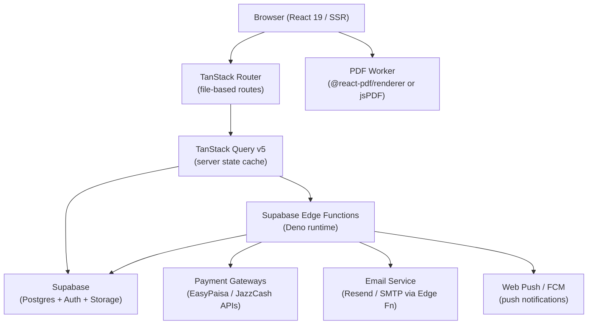
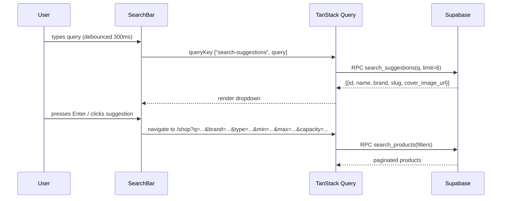
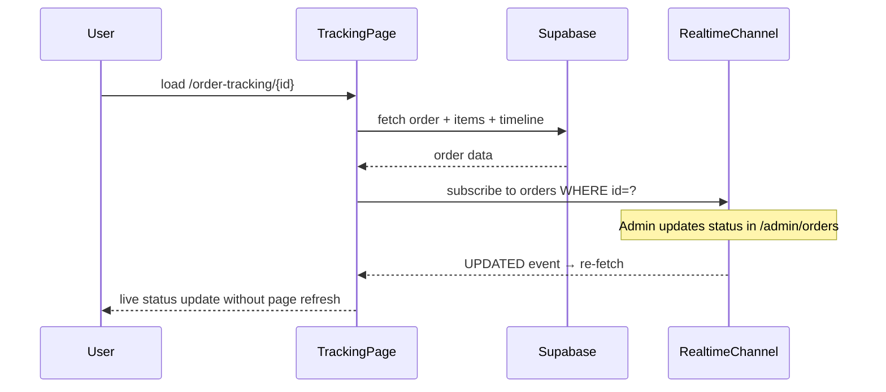
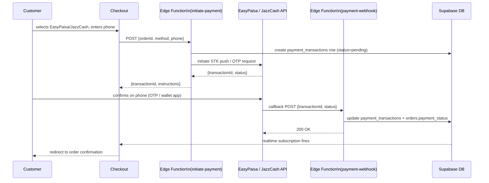
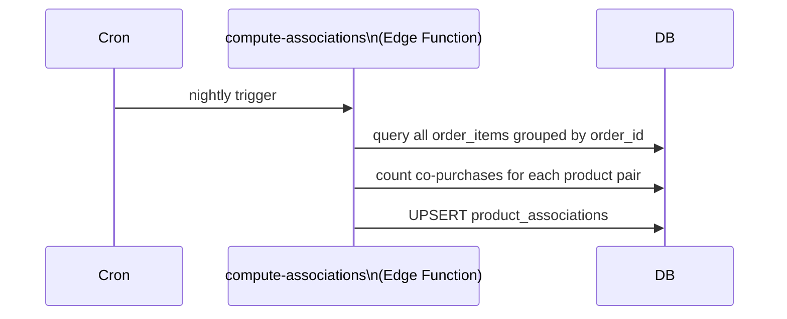
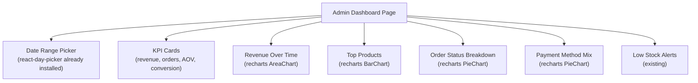
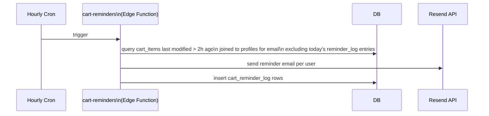
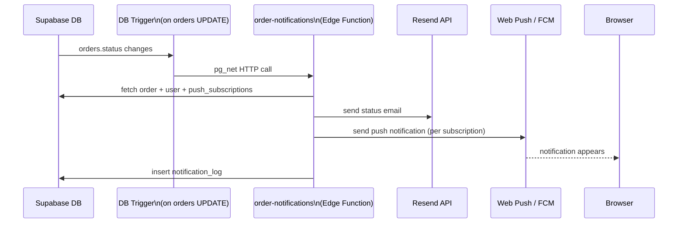

# Design Document: E-Commerce Enhancements — Asif Brothers

## Overview

This document covers 15 professional e-commerce features to be added to the Asif Brothers geyser
retail platform. The project runs on TanStack Start (React 19, SSR) + Vite 8 on Bun, with
TanStack Router (file-based), TanStack Query v5, Supabase (PostgreSQL, Auth, Storage, Edge
Functions), Tailwind CSS v4, shadcn/ui, react-hook-form + Zod, Sonner toasts, and Lucide icons.
All monetary values are in PKR. The live payment method is Cash on Delivery (COD); Stripe fields
exist but are disabled. Existing tables: products, categories, product_images, cart_items, orders,
order_items, addresses, reviews, wishlist_items, coupons, contact_messages, profiles, user_roles.

The 15 features are grouped into six functional pillars:

1. **Discovery** — Product search with autocomplete (F1), Advanced filters (F2), Image zoom & gallery (F12), Multi-image product variants (F14)
2. **Recommendations** — Recently Viewed (F8), Frequently Bought Together (F9)
3. **Checkout & Payments** — EasyPaisa/JazzCash integration (F5), Bank transfer option (F6), Estimated delivery dates (F13)
4. **Post-Purchase** — Order tracking page (F3), Invoice/PDF download (F4), Push/email notifications (F15)
5. **Merchandising** — Product comparison (F7), Abandoned cart reminders (F11)
6. **Admin** — Analytics dashboard (F10)

---

## Architecture



Key architectural decisions:

- **SSR loaders** (`loader` in `createFileRoute`) pre-fetch critical data via `queryClient.ensureQueryData`.
- **Edge Functions** handle all server-side secrets (payment keys, email API keys, VAPID keys for push).
- **Realtime subscriptions** (`supabase.channel`) power live order-status updates on the tracking page.
- **localStorage** is used for guest "recently viewed" and "compare" state; synced to DB for logged-in users.
- **Full-text search** uses Postgres `tsvector` / `websearch_to_tsquery` on the `products` table.

---

## Database Schema Changes

### New Tables

```sql
-- F1/F2: Full-text search vector (materialized column, no new table needed)
-- Add to products table:
ALTER TABLE products ADD COLUMN search_vector tsvector
  GENERATED ALWAYS AS (
    setweight(to_tsvector('english', coalesce(name,'')), 'A') ||
    setweight(to_tsvector('english', coalesce(brand,'')), 'B') ||
    setweight(to_tsvector('english', coalesce(short_description,'')), 'C')
  ) STORED;
CREATE INDEX products_search_idx ON products USING GIN(search_vector);

-- F8: Recently viewed
CREATE TABLE recently_viewed (
  id          uuid PRIMARY KEY DEFAULT gen_random_uuid(),
  user_id     uuid REFERENCES auth.users ON DELETE CASCADE,
  product_id  uuid REFERENCES products(id) ON DELETE CASCADE,
  viewed_at   timestamptz NOT NULL DEFAULT now(),
  UNIQUE(user_id, product_id)
);
CREATE INDEX rv_user_idx ON recently_viewed(user_id, viewed_at DESC);

-- F9: Frequently bought together (aggregate view updated by Edge Function)
CREATE TABLE product_associations (
  product_a_id  uuid REFERENCES products(id) ON DELETE CASCADE,
  product_b_id  uuid REFERENCES products(id) ON DELETE CASCADE,
  co_purchase_count integer NOT NULL DEFAULT 1,
  updated_at    timestamptz NOT NULL DEFAULT now(),
  PRIMARY KEY (product_a_id, product_b_id)
);

-- F5/F6: Payment methods & transactions
CREATE TABLE payment_transactions (
  id              uuid PRIMARY KEY DEFAULT gen_random_uuid(),
  order_id        uuid REFERENCES orders(id) ON DELETE CASCADE,
  method          text NOT NULL, -- 'easypaisa' | 'jazzcash' | 'bank_transfer' | 'cod'
  provider_ref    text,          -- gateway transaction ID
  amount_pkr      numeric(12,2) NOT NULL,
  status          text NOT NULL DEFAULT 'pending', -- 'pending'|'processing'|'succeeded'|'failed'
  metadata        jsonb,
  created_at      timestamptz NOT NULL DEFAULT now(),
  updated_at      timestamptz NOT NULL DEFAULT now()
);

-- F7: Product comparison (session-based, no DB table required — uses localStorage)

-- F10: Analytics events
CREATE TABLE analytics_events (
  id          bigserial PRIMARY KEY,
  event_type  text NOT NULL,  -- 'page_view'|'product_view'|'add_to_cart'|'purchase'
  product_id  uuid REFERENCES products(id) ON DELETE SET NULL,
  order_id    uuid REFERENCES orders(id) ON DELETE SET NULL,
  user_id     uuid,
  session_id  text,
  value_pkr   numeric(12,2),
  metadata    jsonb,
  created_at  timestamptz NOT NULL DEFAULT now()
);
CREATE INDEX ae_type_date ON analytics_events(event_type, created_at DESC);
CREATE INDEX ae_product ON analytics_events(product_id, created_at DESC);

-- F11: Abandoned cart reminders
CREATE TABLE cart_reminder_log (
  id          uuid PRIMARY KEY DEFAULT gen_random_uuid(),
  user_id     uuid REFERENCES auth.users ON DELETE CASCADE,
  sent_at     timestamptz NOT NULL DEFAULT now(),
  cart_value  numeric(12,2),
  UNIQUE(user_id, (sent_at::date))  -- at most one reminder per user per day
);

-- F13: Delivery estimates (per province/city, managed in admin)
CREATE TABLE delivery_estimates (
  id            uuid PRIMARY KEY DEFAULT gen_random_uuid(),
  province      text NOT NULL,
  city          text,
  min_days      int NOT NULL DEFAULT 3,
  max_days      int NOT NULL DEFAULT 7,
  is_active     boolean NOT NULL DEFAULT true
);

-- F15: Push notification subscriptions
CREATE TABLE push_subscriptions (
  id          uuid PRIMARY KEY DEFAULT gen_random_uuid(),
  user_id     uuid REFERENCES auth.users ON DELETE CASCADE,
  endpoint    text NOT NULL UNIQUE,
  p256dh      text NOT NULL,
  auth_key    text NOT NULL,
  created_at  timestamptz NOT NULL DEFAULT now()
);

-- F15: Notification log
CREATE TABLE notification_log (
  id          uuid PRIMARY KEY DEFAULT gen_random_uuid(),
  user_id     uuid REFERENCES auth.users ON DELETE CASCADE,
  order_id    uuid REFERENCES orders(id) ON DELETE SET NULL,
  channel     text NOT NULL,  -- 'email' | 'push'
  event_type  text NOT NULL,  -- 'order_placed' | 'shipped' | 'delivered' | 'cart_reminder'
  sent_at     timestamptz NOT NULL DEFAULT now(),
  status      text NOT NULL DEFAULT 'sent'
);
```

### Modifications to Existing Tables

```sql
-- orders: add payment method, estimated delivery, tracking
ALTER TABLE orders
  ADD COLUMN payment_method   text NOT NULL DEFAULT 'cod',
  ADD COLUMN estimated_delivery_date date,
  ADD COLUMN tracking_number text,
  ADD COLUMN tracking_carrier text;

-- products: add geyser type field for filter F2
ALTER TABLE products
  ADD COLUMN geyser_type text;  -- 'electric'|'gas'|'solar'|'instant'

-- product_images: add variant label for F14
ALTER TABLE product_images
  ADD COLUMN variant_label text;  -- e.g. 'White', 'Rose Gold', null = default

-- Add payment_method enum
ALTER TYPE payment_status ADD VALUE IF NOT EXISTS 'processing';
```

---

## Feature 1 & 2: Product Search with Autocomplete + Advanced Filters

### Architecture



### New Route

`src/routes/shop.tsx` — extend existing shop page with URL search params.

### TypeScript Interfaces

```typescript
// Search & filter params (validated with Zod in route definition)
interface ShopSearchParams {
  q?: string; // free-text query
  brand?: string; // comma-separated brands
  type?: string; // 'electric' | 'gas' | 'solar' | 'instant'
  minPrice?: number;
  maxPrice?: number;
  capacity?: number; // exact liters
  sort?: "price_asc" | "price_desc" | "newest" | "relevance";
  page?: number;
}

interface SearchSuggestion {
  id: string;
  name: string;
  brand: string | null;
  slug: string;
  cover_image_url: string | null;
  price_pkr: number;
  discount_price_pkr: number | null;
}

interface ProductSearchResult {
  items: SearchSuggestion[];
  total: number;
  page: number;
  pageSize: number;
}
```

### Key Functions

```typescript
// src/lib/search.ts

/**
 * Debounce helper — returns a debounced version of fn.
 * Preconditions: fn is a function, delay >= 0
 * Postconditions: returned function delays fn call by `delay` ms,
 *                 cancels any pending call when invoked again
 */
function debounce<T extends (...args: any[]) => void>(fn: T, delay: number): T;

/**
 * Fetch autocomplete suggestions from Postgres full-text search.
 * Preconditions: query.length >= 2
 * Postconditions: returns at most `limit` results ranked by ts_rank
 */
async function fetchSuggestions(query: string, limit = 6): Promise<SearchSuggestion[]>;

/**
 * Fetch paginated filtered products.
 * Preconditions: filters is a valid ShopSearchParams object
 * Postconditions: returns ProductSearchResult with total count for pagination
 */
async function fetchProducts(filters: ShopSearchParams): Promise<ProductSearchResult>;
```

### Supabase RPC (SQL)

```sql
-- Full-text search autocomplete
CREATE OR REPLACE FUNCTION search_suggestions(q text, lim int DEFAULT 6)
RETURNS TABLE(id uuid, name text, brand text, slug text,
              cover_image_url text, price_pkr numeric, discount_price_pkr numeric)
LANGUAGE sql STABLE AS $$
  SELECT id, name, brand, slug, cover_image_url, price_pkr, discount_price_pkr
  FROM products
  WHERE is_active = true
    AND (
      search_vector @@ websearch_to_tsquery('english', q)
      OR name ILIKE '%' || q || '%'
    )
  ORDER BY ts_rank(search_vector, websearch_to_tsquery('english', q)) DESC
  LIMIT lim;
$$;
```

### Component Tree

```
SiteHeader
└── SearchCombobox          (src/components/site/SearchCombobox.tsx)
    ├── Input (shadcn)
    └── Popover
        └── SuggestionList
            └── SuggestionItem[]

shop.tsx (route)
├── FilterSidebar           (src/components/shop/FilterSidebar.tsx)
│   ├── BrandCheckboxGroup
│   ├── TypeRadioGroup
│   ├── PriceRangeSlider    (Radix Slider)
│   └── CapacitySelect
└── ProductGrid
    └── ProductCard[]
```

---

## Feature 3: Order Tracking Page

### New Route

`src/routes/order-tracking.$id.tsx`

Accessible to logged-in users (owner) and anyone with the direct URL (guest lookup by order number).

### Architecture



### TypeScript Interfaces

```typescript
interface OrderTimeline {
  status: OrderStatus;
  label: string; // 'Order Placed' | 'Processing' | 'Shipped' | 'Delivered'
  timestamp: string | null;
  isCurrent: boolean;
  isCompleted: boolean;
}

interface TrackingPageData {
  order: Order;
  items: OrderItem[];
  timeline: OrderTimeline[];
  estimatedDelivery: string | null;
  trackingNumber: string | null;
  trackingCarrier: string | null;
}
```

### Key Functions

```typescript
// src/lib/order-tracking.ts

/**
 * Build timeline steps from an order's status.
 * Preconditions:  order is a valid Order row
 * Postconditions: returns array of 5 steps in chronological order,
 *                 exactly one step has isCurrent=true unless cancelled
 */
function buildTimeline(order: Order): OrderTimeline[];

/**
 * Subscribe to realtime order status changes.
 * Preconditions:  orderId is a valid UUID, callback is a function
 * Postconditions: returns a RealtimeChannel subscription;
 *                 callback fires on every status change
 * Loop invariant: channel remains subscribed until unsubscribe() is called
 */
function subscribeToOrderStatus(
  orderId: string,
  callback: (newStatus: OrderStatus) => void,
): RealtimeChannel;
```

### Component Tree

```
order-tracking.$id.tsx
├── OrderStatusBadge
├── TrackingTimeline         (horizontal stepper on desktop, vertical on mobile)
│   └── TimelineStep[]
├── OrderItemsList
├── ShippingAddressCard
├── DeliveryEstimateCard     (shows estimated_delivery_date from orders table)
└── TrackingCarrierLink      (links to carrier site if tracking_number present)
```

---

## Feature 4: Invoice / PDF Download

### Approach

Generate PDF client-side using `@react-pdf/renderer` (React-PDF). This avoids Edge Function cold
starts for a blocking user-triggered action. The PDF is streamed as a Blob URL and triggered via
`<a download>`.

### New Dependency

```
@react-pdf/renderer  ^4.x
```

### TypeScript Interfaces

```typescript
interface InvoiceData {
  orderNumber: string;
  orderDate: string;
  customerName: string;
  customerEmail: string;
  shippingAddress: ShippingAddress;
  items: InvoiceLineItem[];
  subtotal: number;
  discount: number;
  shipping: number;
  total: number;
  paymentMethod: string;
  invoiceNumber: string; // = 'INV-' + orderNumber
}

interface InvoiceLineItem {
  sku: string;
  name: string;
  quantity: number;
  unitPrice: number;
  subtotal: number;
}
```

### Key Functions

```typescript
// src/components/invoice/InvoiceDocument.tsx

/**
 * React-PDF Document component rendering the invoice.
 * Preconditions:  data is a complete InvoiceData object
 * Postconditions: returns a @react-pdf/renderer Document element
 *                 with Asif Brothers branding, all line items, and totals
 */
function InvoiceDocument(props: { data: InvoiceData }): JSX.Element;

// src/lib/invoice.ts

/**
 * Generate and download a PDF invoice for the given order.
 * Preconditions:  orderId is a valid UUID for an order owned by the current user
 * Postconditions: triggers browser download of 'Invoice-{orderNumber}.pdf'
 *                 no server calls made — pure client computation
 */
async function downloadInvoice(orderId: string): Promise<void>;
```

### Integration Point

Added as a button on:

- `src/routes/order-confirmation.$id.tsx` — "Download Invoice" button
- `src/routes/_authenticated.account.orders.tsx` — per-order row action

---

## Feature 5 & 6: EasyPaisa, JazzCash & Bank Transfer Payments

### Architecture

Pakistan's EasyPaisa and JazzCash offer merchant APIs (REST, HMAC-signed). Bank transfer is a
manual flow: customer submits a screenshot/reference, admin confirms.



### Edge Functions

```
supabase/functions/
├── initiate-payment/index.ts
├── payment-webhook/index.ts
└── verify-bank-transfer/index.ts   (admin-only, marks bank transfer confirmed)
```

### TypeScript Interfaces

```typescript
// Sent from checkout to initiate-payment Edge Function
interface InitiatePaymentRequest {
  orderId: string;
  method: "easypaisa" | "jazzcash" | "bank_transfer";
  phone?: string; // required for EasyPaisa/JazzCash
  amount: number; // in PKR
}

interface InitiatePaymentResponse {
  transactionId: string;
  instructions: string;
  requiresPolling: boolean;
}

// Bank transfer submission
interface BankTransferSubmission {
  orderId: string;
  bankName: string;
  accountTitle: string;
  transactionRef: string;
  transferDate: string;
  screenshotUrl?: string; // uploaded to Supabase Storage
}
```

### Key Edge Function Logic (Pseudocode)

```typescript
// initiate-payment/index.ts
async function handler(req: Request): Promise<Response> {
  const { orderId, method, phone, amount } = await req.json();

  // Validate order ownership via JWT in Authorization header
  const user = await verifyAuth(req);
  const order = await getOrder(orderId);
  if (order.user_id !== user.id) return forbidden();

  if (method === "easypaisa") {
    const result = await easypaisaSTKPush({ phone, amount, orderId });
    await createTransaction({ orderId, method, providerRef: result.transactionId, amount });
    return json({
      transactionId: result.transactionId,
      instructions: "Check your Easypaisa app to confirm payment.",
    });
  }

  if (method === "jazzcash") {
    const result = await jazzcashMWalletPush({ phone, amount, orderId });
    await createTransaction({ orderId, method, providerRef: result.txnRefNo, amount });
    return json({
      transactionId: result.txnRefNo,
      instructions: "Check your JazzCash app to confirm payment.",
    });
  }

  if (method === "bank_transfer") {
    await createTransaction({ orderId, method, amount, status: "processing" });
    return json({ transactionId: orderId, instructions: BANK_TRANSFER_INSTRUCTIONS });
  }
}
```

### Checkout UI Changes (checkout.tsx)

Replace the current "Card payment (coming soon)" block with:

```typescript
// New payment options rendered in checkout
const PAYMENT_METHODS = [
  { id: "cod", label: "Cash on Delivery", icon: Banknote, available: true },
  { id: "easypaisa", label: "EasyPaisa", icon: Smartphone, available: true },
  { id: "jazzcash", label: "JazzCash", icon: Smartphone, available: true },
  { id: "bank_transfer", label: "Bank Transfer", icon: Building2, available: true },
] as const;

type PaymentMethodId = (typeof PAYMENT_METHODS)[number]["id"];
```

For `easypaisa`/`jazzcash`: show a phone number input field below the selector.
For `bank_transfer`: show the bank account details and a file upload for screenshot.

### Bank Transfer Instructions (stored in Edge Function env)

```
Bank: Meezan Bank
Account Title: Asif Brothers Pvt Ltd
Account No: 0123-0123456789
IBAN: PK36MEZN0001230123456789
```

---

## Feature 7: Product Comparison

### Design

Up to 3 products can be compared side-by-side. State lives in a `useCompare` hook backed by
`localStorage` (key: `ab_compare`). A floating compare bar appears at the bottom when ≥ 2 items
are selected.

### New Route

`src/routes/compare.tsx` — full comparison table page.

### TypeScript Interfaces

```typescript
interface CompareState {
  ids: string[]; // max 3 product IDs
}

interface CompareRow {
  key: string;
  label: string;
  values: (string | number | null)[];
}
```

### Key Functions

```typescript
// src/hooks/use-compare.ts

/**
 * Hook providing compare state management.
 * Postconditions:
 *   - ids.length <= 3 at all times
 *   - addProduct is a no-op when ids.length === 3 and id not in ids
 *   - removeProduct is a no-op when id not in ids
 */
function useCompare(): {
  ids: string[];
  addProduct(id: string): void;
  removeProduct(id: string): void;
  clearAll(): void;
  canAdd: boolean;
};

// src/lib/compare.ts

/**
 * Build comparison rows from an array of products.
 * Preconditions:  products.length is between 2 and 3
 * Postconditions: returns rows for: price, brand, capacity, warranty,
 *                 energy_rating, geyser_type, plus each spec key
 */
function buildCompareRows(products: Product[]): CompareRow[];
```

### Component Tree

```
compare.tsx
├── CompareHeader  (product names + images, remove button)
├── CompareTable
│   └── CompareRow[]   (highlights best/lowest value per row)
└── AddToCartRow

ProductCard (extended)
└── CompareCheckbox  (adds/removes from compare state)

CompareBar  (fixed bottom bar, shown when ids.length >= 1)
├── CompareProductThumb[]
├── "Compare (N)" button → navigates to /compare
└── Clear button
```

---

## Feature 8: Recently Viewed Section

### Architecture

- **Guest users**: store up to 10 product IDs in `localStorage` key `ab_rv`.
- **Logged-in users**: write to `recently_viewed` table on product page load; read back on home page + account page.
- A `useRecentlyViewed` hook unifies both paths.

### Key Functions

```typescript
// src/hooks/use-recently-viewed.ts

/**
 * Record that the current user/guest viewed a product.
 * Preconditions:  productId is a valid UUID
 * Postconditions:
 *   - For guests: productId is at index 0 of localStorage array (max 10)
 *   - For logged-in: upserts recently_viewed row, updates viewed_at
 *   - productId appears exactly once in the list
 */
async function recordView(productId: string): Promise<void>;

/**
 * Fetch recently viewed products for display.
 * Postconditions: returns up to 8 products ordered by most recent first
 *                 empty array if no history exists
 */
async function fetchRecentlyViewed(): Promise<ProductCardData[]>;
```

### Integration Points

- `product.$slug.tsx` — call `recordView(product.id)` on mount
- `index.tsx` (home page) — render `<RecentlyViewedSection />` below Featured Products
- `_authenticated.account.index.tsx` — render in account page

---

## Feature 9: Frequently Bought Together

### Architecture

The `product_associations` table is populated by a Supabase Edge Function
(`compute-associations`) triggered on a nightly cron schedule (pg_cron or Supabase cron).



### Edge Function Logic (Pseudocode)

```typescript
// supabase/functions/compute-associations/index.ts

async function computeAssociations() {
  // Fetch all orders with 2+ items in the last 90 days
  const orders = await db.query(`
    SELECT order_id, array_agg(product_id) as products
    FROM order_items
    WHERE product_id IS NOT NULL
    GROUP BY order_id
    HAVING count(*) >= 2
    AND order_id IN (
      SELECT id FROM orders WHERE created_at > now() - interval '90 days'
    )
  `);

  const counts = new Map<string, number>();

  for (const { products } of orders) {
    // Generate all unique pairs
    for (let i = 0; i < products.length; i++) {
      for (let j = i + 1; j < products.length; j++) {
        const key = [products[i], products[j]].sort().join("|");
        counts.set(key, (counts.get(key) ?? 0) + 1);
      }
    }
  }

  // Upsert into product_associations
  const rows = [...counts.entries()].map(([key, count]) => {
    const [a, b] = key.split("|");
    return { product_a_id: a, product_b_id: b, co_purchase_count: count };
  });
  await db.upsert("product_associations", rows, { onConflict: "product_a_id,product_b_id" });
}
```

### Integration Point

`product.$slug.tsx` — below the existing "You may also like" (related by category) section,
add `<FrequentlyBoughtTogether productId={p.id} />` component. Query:

```typescript
// queryKey: ['fbt', productId]
// Fetch top 3 associated products, join product details
async function fetchFBT(productId: string): Promise<ProductCardData[]>;
```

---

## Feature 10: Admin Analytics Dashboard

### Overview

Extends `_authenticated.admin.index.tsx` with rich charts powered by **recharts** (already in
`package.json`). Data is queried directly from Supabase with aggregation performed in SQL via RPCs
or views — no separate analytics service needed.

### Architecture



### New Route

`src/routes/_authenticated.admin.analytics.tsx`

Also promote the existing simple `_authenticated.admin.index.tsx` to link to `/admin/analytics`.

### TypeScript Interfaces

```typescript
interface AnalyticsFilters {
  from: string; // ISO date
  to: string;
}

interface RevenueDataPoint {
  date: string; // 'YYYY-MM-DD'
  revenue: number;
  orders: number;
}

interface TopProduct {
  productId: string;
  name: string;
  unitsSold: number;
  revenue: number;
}

interface KPISnapshot {
  totalRevenue: number;
  totalOrders: number;
  averageOrderValue: number;
  newCustomers: number;
  abandonedCarts: number;
}
```

### Key Functions (Supabase RPCs)

```sql
-- Revenue by day
CREATE OR REPLACE FUNCTION analytics_revenue_by_day(from_date date, to_date date)
RETURNS TABLE(date date, revenue numeric, order_count bigint)
LANGUAGE sql STABLE AS $$
  SELECT created_at::date AS date,
         SUM(total_pkr) AS revenue,
         COUNT(*) AS order_count
  FROM orders
  WHERE payment_status = 'succeeded'
    AND created_at::date BETWEEN from_date AND to_date
  GROUP BY 1 ORDER BY 1;
$$;

-- Top selling products
CREATE OR REPLACE FUNCTION analytics_top_products(from_date date, to_date date, lim int DEFAULT 10)
RETURNS TABLE(product_id uuid, name text, units_sold bigint, revenue numeric)
LANGUAGE sql STABLE AS $$
  SELECT oi.product_id, oi.product_name AS name,
         SUM(oi.quantity) AS units_sold,
         SUM(oi.subtotal_pkr) AS revenue
  FROM order_items oi
  JOIN orders o ON o.id = oi.order_id
  WHERE o.payment_status = 'succeeded'
    AND o.created_at::date BETWEEN from_date AND to_date
  GROUP BY 1,2 ORDER BY units_sold DESC LIMIT lim;
$$;
```

### Chart Component Signatures

```typescript
// src/components/admin/RevenueChart.tsx
function RevenueChart(props: { data: RevenueDataPoint[]; height?: number }): JSX.Element;

// src/components/admin/TopProductsChart.tsx
function TopProductsChart(props: { data: TopProduct[]; height?: number }): JSX.Element;

// src/components/admin/KPICard.tsx
function KPICard(props: {
  label: string;
  value: string | number;
  trend?: number; // percent change vs previous period
  icon: LucideIcon;
}): JSX.Element;
```

---

## Feature 11: Abandoned Cart Reminders

### Architecture

A Supabase scheduled Edge Function runs every hour, finds carts abandoned for > 2 hours,
and sends one reminder per user per day via email (Resend) or push notification.



### Edge Function: cart-reminders

```typescript
// supabase/functions/cart-reminders/index.ts

interface AbandonedCart {
  userId: string;
  email: string;
  fullName: string | null;
  items: { name: string; price: number; imageUrl: string }[];
  cartValue: number;
}

/**
 * Find carts abandoned for more than `thresholdHours` hours.
 * Preconditions:  thresholdHours > 0
 * Postconditions: returns carts where:
 *   - at least one cart_item exists for the user
 *   - the most recent cart_item.created_at is older than thresholdHours
 *   - no cart_reminder_log entry exists for user today
 *   - user has a profile with email
 */
async function findAbandonedCarts(thresholdHours = 2): Promise<AbandonedCart[]>;

/**
 * Send a reminder email for one abandoned cart.
 * Postconditions: email is sent via Resend API with product images,
 *                 cart total, and a CTA link to /cart
 */
async function sendReminderEmail(cart: AbandonedCart): Promise<void>;
```

### Email Template

Plain-text + HTML email with:

- Subject: `"You left something in your cart, {firstName}!"`
- List of up to 3 cart items with thumbnail, name, price in PKR
- Cart total
- CTA button: "Complete Your Purchase → asifbrothers.pk/cart"
- Unsubscribe footer

---

## Feature 12: Image Zoom and Gallery

### Design

The product detail page currently shows a single cover image. This feature replaces it with:

1. A **thumbnail strip** (horizontal scrollable row) showing all `product_images` rows.
2. A **main image viewer** with pinch-to-zoom on mobile and mouse-hover zoom on desktop.
3. A **lightbox** (Dialog from shadcn/ui) for full-screen view.

No new npm package needed — zoom is implemented with CSS `transform: scale()` + pointer event
tracking. For production quality, `react-image-magnifiers` or a custom approach using CSS
`object-fit: none` can be used.

### Component Signatures

```typescript
// src/components/product/ProductImageGallery.tsx

interface GalleryImage {
  url: string;
  alt: string | null;
  variantLabel: string | null;
}

/**
 * Full gallery component: thumbnails + zoom viewer + lightbox.
 * Preconditions:  images.length >= 1
 * Postconditions:
 *   - Selected image shown in main viewer (default: index 0)
 *   - Hover/touch on main image shows zoom overlay
 *   - Click on main image opens lightbox Dialog
 *   - Keyboard: ArrowLeft/Right navigate between images
 */
function ProductImageGallery(props: { images: GalleryImage[]; productName: string }): JSX.Element;

// src/components/product/ZoomableImage.tsx

/**
 * Single image with mouse-follow zoom effect.
 * Preconditions:  src is a valid URL
 * Postconditions:
 *   - On mouse enter: shows zoom lens cursor
 *   - On mouse move: transforms a zoomed copy to follow cursor (2.5x scale)
 *   - On mouse leave: resets to original view
 *   - On mobile (touch): pinch-to-zoom via CSS touch-action: pinch-zoom
 */
function ZoomableImage(props: {
  src: string;
  alt: string;
  zoomScale?: number; // default 2.5
}): JSX.Element;
```

### Integration

`product.$slug.tsx` — replace the single `` block with `<ProductImageGallery>`.
Pass `product_images` rows sorted by `sort_order`, falling back to `cover_image_url` if empty.

---

## Feature 13: Estimated Delivery Dates

### Design

On checkout and order confirmation, show a date range (e.g. "Estimated delivery: 15–18 Jul 2025")
based on the customer's province/city, looked up in the `delivery_estimates` table.

### Key Functions

```typescript
// src/lib/delivery.ts

/**
 * Look up estimated delivery date range for a shipping address.
 * Preconditions:  province is a non-empty string
 * Postconditions:
 *   - Returns {minDate, maxDate} as Date objects
 *   - If no specific city match, falls back to province-level estimate
 *   - If no province match, uses national default (5–10 days)
 *   - Skips Sundays from the day count (Pakistani business days)
 */
async function getDeliveryEstimate(
  province: string,
  city?: string,
): Promise<{ minDate: Date; maxDate: Date }>;

/**
 * Format a delivery estimate for display.
 * Postconditions: returns a string like "15–18 Jul 2025"
 */
function formatDeliveryRange(minDate: Date, maxDate: Date): string;
```

### Integration Points

- `checkout.tsx` — display estimate below the shipping address section once address is filled
- `order-confirmation.$id.tsx` — show confirmed estimated delivery
- `order-tracking.$id.tsx` — show with a calendar icon

### Admin Management

New admin route: `src/routes/_authenticated.admin.delivery.tsx`
Table UI for CRUD on `delivery_estimates` rows (province, city, min_days, max_days).

---

## Feature 14: Multi-Image Product Variants

### Design

Each `product_images` row gets an optional `variant_label` column (e.g. "White", "Rose Gold",
"Graphite"). On the product page, variant selector buttons appear when images have labels. Selecting
a variant filters the gallery to that variant's images.

This is **display-only** variant support (no separate SKU/pricing per variant). Full SKU variants
are out of scope for this spec.

### TypeScript Interfaces

```typescript
interface ProductVariant {
  label: string;
  images: GalleryImage[];
  coverImage: GalleryImage;
}

/**
 * Group product_images into variants.
 * Preconditions:  images is a non-empty array
 * Postconditions:
 *   - Images with null variant_label are in the 'default' group
 *   - Returns variants in insertion order of first occurrence
 *   - If all images have null label, returns single variant with label 'default'
 */
function groupImagesByVariant(images: GalleryImage[]): ProductVariant[];
```

### Component: VariantSelector

```typescript
// src/components/product/VariantSelector.tsx

/**
 * Button row to switch between visual variants.
 * Preconditions:  variants.length >= 2 (hidden when only 1 variant)
 * Postconditions:
 *   - Selected variant is highlighted
 *   - onChange fires with new variant label
 *   - Keyboard accessible (role="radiogroup")
 */
function VariantSelector(props: {
  variants: ProductVariant[];
  selected: string;
  onChange: (label: string) => void;
}): JSX.Element;
```

### Admin: Product Image Upload (Extended)

`_authenticated.admin.products.tsx` — image upload form gets a "Variant label" text input per
image row, persisted to `product_images.variant_label`.

---

## Feature 15: Push & Email Notifications for Order Updates

### Architecture



### Web Push Setup

```typescript
// src/lib/push.ts

/**
 * Register current browser for push notifications.
 * Preconditions:  user is logged in, browser supports Push API
 * Postconditions:
 *   - Service worker is registered at /sw.js
 *   - PushSubscription is stored in push_subscriptions table
 *   - Returns subscription or null if user denies permission
 */
async function registerPushSubscription(): Promise<PushSubscription | null>;

/**
 * Unsubscribe this browser from push notifications.
 * Postconditions: push_subscriptions row is deleted,
 *                 browser subscription is revoked
 */
async function unregisterPushSubscription(): Promise<void>;
```

### Edge Function: order-notifications

```typescript
// supabase/functions/order-notifications/index.ts

interface OrderNotificationPayload {
  orderId: string;
  newStatus: OrderStatus;
  oldStatus: OrderStatus;
}

/**
 * Handle an order status change notification.
 * Preconditions:  orderId is valid, newStatus != oldStatus
 * Postconditions:
 *   - Email sent to order.email via Resend
 *   - Push notification sent to all push_subscriptions for user
 *   - notification_log rows inserted for each channel
 *   - Idempotent: duplicate calls for same (orderId, newStatus) are no-ops
 */
async function handleOrderNotification(payload: OrderNotificationPayload): Promise<void>;
```

### Notification Templates

| Status     | Email Subject                      | Push Title             |
| ---------- | ---------------------------------- | ---------------------- |
| processing | "Your order is being prepared"     | "Order being prepared" |
| shipped    | "Your order is on its way! 🚚"     | "Order shipped!"       |
| delivered  | "Your order has been delivered ✅" | "Order delivered!"     |
| cancelled  | "Your order has been cancelled"    | "Order cancelled"      |

### Service Worker

`public/sw.js` — minimal push notification handler:

```javascript
self.addEventListener("push", (event) => {
  const data = event.data.json();
  event.waitUntil(
    self.registration.showNotification(data.title, {
      body: data.body,
      icon: "/icon-192.png",
      badge: "/badge-72.png",
      data: { url: data.url },
    }),
  );
});

self.addEventListener("notificationclick", (event) => {
  event.notification.close();
  event.waitUntil(clients.openWindow(event.notification.data.url));
});
```

### Account Page Integration

`_authenticated.account.index.tsx` — add "Notifications" section with:

- Toggle: "Email me when my order status changes"
- Toggle: "Browser push notifications" (triggers `registerPushSubscription`)

---

## New File Structure

```
src/
├── components/
│   ├── site/
│   │   └── SearchCombobox.tsx         [F1]
│   ├── shop/
│   │   ├── FilterSidebar.tsx          [F2]
│   │   └── CompareBar.tsx             [F7]
│   ├── product/
│   │   ├── ProductImageGallery.tsx    [F12]
│   │   ├── ZoomableImage.tsx          [F12]
│   │   ├── VariantSelector.tsx        [F14]
│   │   ├── FrequentlyBoughtTogether.tsx [F9]
│   │   └── RecentlyViewedSection.tsx  [F8]
│   ├── invoice/
│   │   └── InvoiceDocument.tsx        [F4]
│   ├── tracking/
│   │   └── TrackingTimeline.tsx       [F3]
│   └── admin/
│       ├── RevenueChart.tsx           [F10]
│       ├── TopProductsChart.tsx       [F10]
│       └── KPICard.tsx               [F10]
├── hooks/
│   ├── use-compare.ts                 [F7]
│   ├── use-recently-viewed.ts         [F8]
│   └── use-push-notifications.ts      [F15]
├── lib/
│   ├── search.ts                      [F1/F2]
│   ├── invoice.ts                     [F4]
│   ├── order-tracking.ts              [F3]
│   ├── delivery.ts                    [F13]
│   ├── push.ts                        [F15]
│   └── compare.ts                     [F7]
└── routes/
    ├── shop.tsx                       [F1/F2 extended]
    ├── order-tracking.$id.tsx         [F3]
    ├── compare.tsx                    [F7]
    └── _authenticated/
        └── admin/
            ├── analytics.tsx          [F10]
            └── delivery.tsx           [F13 admin]

supabase/
└── functions/
    ├── initiate-payment/              [F5/F6]
    ├── payment-webhook/               [F5/F6]
    ├── verify-bank-transfer/          [F6]
    ├── order-notifications/           [F15]
    ├── cart-reminders/               [F11]
    └── compute-associations/          [F9]

public/
└── sw.js                             [F15]
```

---

## Error Handling Strategy

| Feature   | Error Scenario                  | Handling                                                         |
| --------- | ------------------------------- | ---------------------------------------------------------------- |
| F1 Search | Supabase query fails            | Show "Search unavailable" in dropdown, log to console            |
| F4 PDF    | react-pdf render error          | Show toast "Could not generate PDF", offer "Print page" fallback |
| F5/F6 Pay | Gateway timeout                 | Show "Payment is processing — check your phone" UI, poll status  |
| F5/F6 Pay | Webhook not received in 10 min  | Cron marks stale pending transactions as 'failed' after 15 min   |
| F6 Bank   | Screenshot upload fails         | Show error, allow retry, store reference manually                |
| F11 Email | Resend API failure              | Log to `notification_log` with status='failed', retry next hour  |
| F15 Push  | Permission denied               | Silently skip, show "Enable push" prompt once per session        |
| F9 FBT    | compute-associations cron fails | Stale data still served, no UI impact                            |

---

## Security Considerations

- **Payment webhook validation**: All incoming webhooks from EasyPaisa/JazzCash are verified with HMAC-SHA256 using gateway-provided secret keys stored in Supabase Edge Function environment variables — never in client code.
- **Order ownership**: All order-related Edge Functions verify the requesting JWT's `sub` matches `orders.user_id` before returning data.
- **Admin RPCs**: Analytics RPCs are restricted via Postgres RLS policy `has_role('admin', auth.uid())`.
- **Push VAPID keys**: Stored only in Edge Function env; public key is safe to expose to client.
- **Bank transfer screenshots**: Uploaded to a private Supabase Storage bucket accessible only to the order owner and admins.
- **PDF generation**: Client-side only — no order data leaves the browser to a third-party PDF service.

---

## Performance Considerations

- **Search debounce**: 300 ms delay on autocomplete prevents excessive RPC calls.
- **Search index**: `GIN` index on `products.search_vector` ensures sub-50ms autocomplete even with thousands of products.
- **Analytics queries**: RPCs use date-bounded queries and indexed columns; results are cached in TanStack Query for 5 minutes (`staleTime: 5 * 60 * 1000`).
- **PDF rendering**: Lazy-loaded with `React.lazy(() => import('@react-pdf/renderer'))` to avoid bloating the main bundle.
- **FBT / Recently Viewed**: Cached with `staleTime: 10 * 60 * 1000` — data freshness requirements are low.
- **Image gallery**: All thumbnail images use `loading="lazy"`. Zoom overlay is `position: absolute` and never triggers layout reflow.
- **Push subscriptions**: Service worker registered only after user confirms in account settings, not on every page load.

---

## Testing Strategy

### Unit Tests

Key pure functions to unit test:

- `buildTimeline(order)` — test each of 7 order statuses
- `buildCompareRows(products)` — test with 2 and 3 products, including sparse specs
- `groupImagesByVariant(images)` — test with mixed/null labels
- `formatDeliveryRange(min, max)` — cross-month, same-month, year-boundary
- `formatPKR(amount)` — existing, extend with edge cases

### Integration Tests

- Search autocomplete: mock Supabase, verify debounce and query formation
- Payment flow: mock Edge Function, verify transaction row creation and status propagation

### Property-Based Tests (fast-check)

- `buildTimeline`: for any valid `order_status`, exactly one step is `isCurrent`
- `buildCompareRows`: for any 2–3 products, `values.length` always equals `products.length`
- `formatPKR`: for any non-negative number, output starts with "Rs " and contains no decimal

---

## Dependencies to Add

| Package               | Version | Purpose                  |
| --------------------- | ------- | ------------------------ |
| `@react-pdf/renderer` | `^4.x`  | Client-side PDF invoice  |
| `web-push` (Edge Fn)  | `^3.x`  | VAPID push notifications |
| `resend` (Edge Fn)    | `^4.x`  | Transactional email      |

All other needs (recharts, Radix UI, date-fns, embla-carousel, Zod) are already in `package.json`.
